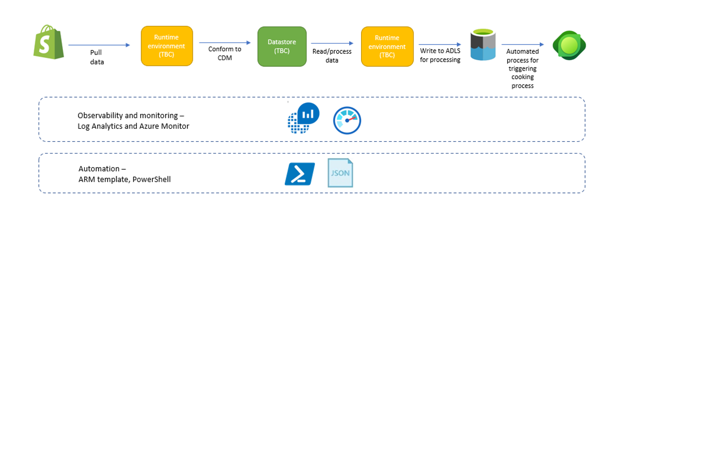

# Intelligent Recommendations

Goal of this guidance is to provide prescriptive guidance for enterprise-scale deployment of Intelligent Recommendations (IR) service.

## Overview

[Intelligent Recommendations](https://docs.microsoft.com/en-us/industry/retail/intelligent-recommendations/overview) democratizes AI and machine learning recommendations through a codeless and powerful experience powered by the same technology that fuels Xbox, Microsoft 365, and Microsoft Azure. Businesses can now provide relevant discovery for customers with this new, innovative AI for personalization and recommendations.

Intelligent Recommendations IR) is one of the features included in Microsoft Cloud for Retail. While Microsoft Cloud for Retail is in Public Preview, Intelligent Recommendations is now generally available. Whilst the service as a standalone offering is new, the algorithm behind the service has been in use for a few years as part of Dynamics Commerce.

## Capabilities

The IR service uses input datasets and configuration parameters to determine the type of [recommendation scenarios](https://docs.microsoft.com/en-us/industry/retail/intelligent-recommendations/overview). These are:

- Personalized recommendations for end-users
- Similar items
- Real-time and session-based recommendations for users
- Basket completion

## Architecture

### Terminology

- `Cooking process` is the backend process of reading; processing and modelling data according to business needs.
- `User interactions` are the interactions between users and items that Intelligent Recommendations models learn from and use to predict future interactions. Examples of user interactions include click streams, purchases etc. The data is stored in CSV format a

### Integration points

IR is a scalable headless service and it has two key integration points:

1. ADLS Gen2 storage for storing input datasets and making them available for IR for processing.
2. Frontend APIs where the recommendations (or output) are made available for consumption via applications.

### Service flow

The recommendations process can be broken down into three key steps:

1. Read input datasets (user interactions such as purchase, downloads, views etc.) and configuration from an ADLS Storage Account. IR requires a specific data model and base configuration to build recommendations.These are defined as part of `model.json` file.
2. "Cooking process" is the backend process managed by IR service where datasets (user interactions) are read from ADLS and processed by IR service.
3. Data serving part where the results are made available to the customer through a set of published APIs.

### Default deployment

// image goes here

